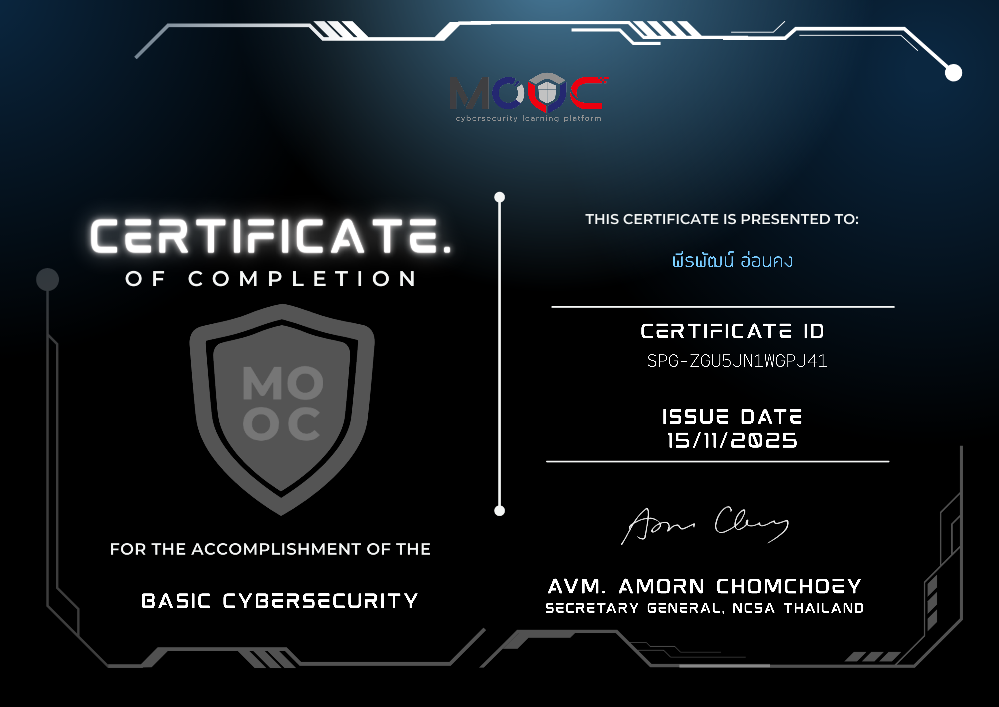
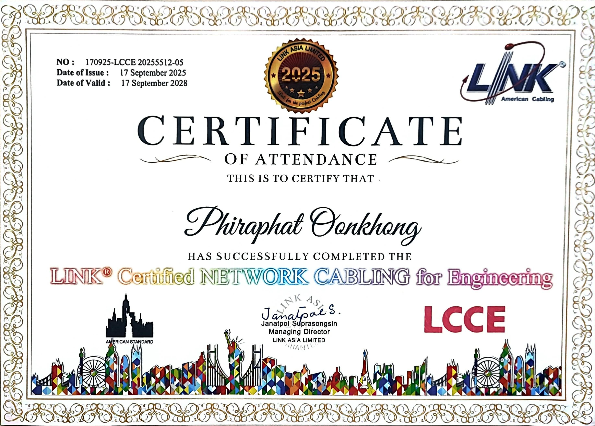
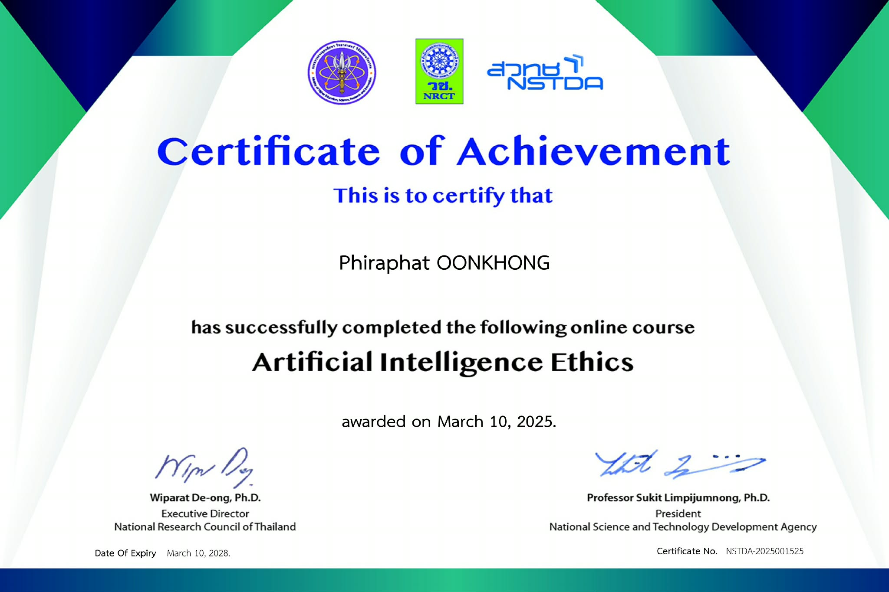

# 🎓 My Certificates
*A collection of professional certifications and technical skills validation.*

## 🏆 Certification Showcase

| Certificate Name | Preview |
| :--- | :---: |
| **FutureDevType Script** |  |
| **Cyber-Security (MOOC)** |  |
| **American Cabling** |  |
| **Artificial Intelligence Ethics** |  |

---

### 🚀 Summary of Skills
- **Back-End Architectures:** Dedicated to building high-performance and scalable systems.
- **Security & Data:** Focused on systematic data management and secure software solutions.
- **Front-End Presentation:** Experience in modern UI/UX using Vue.js and Figma.
